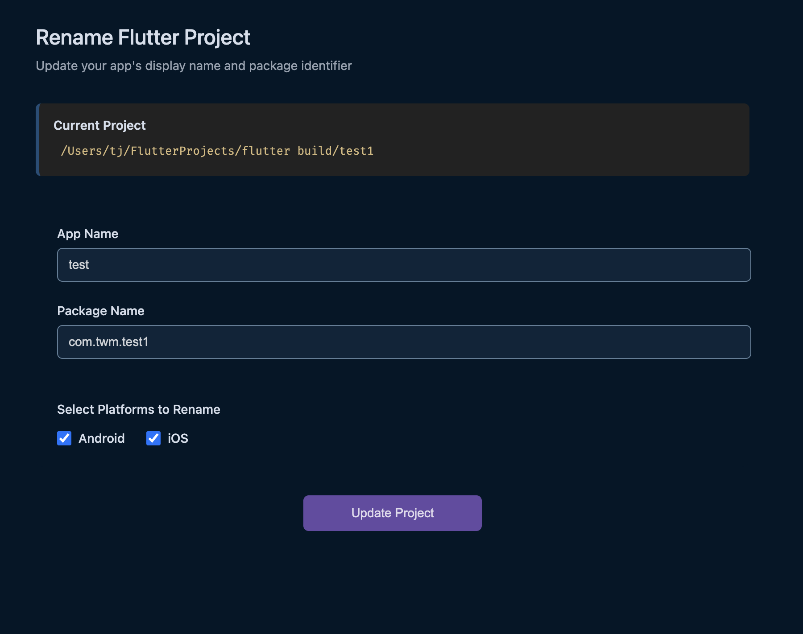
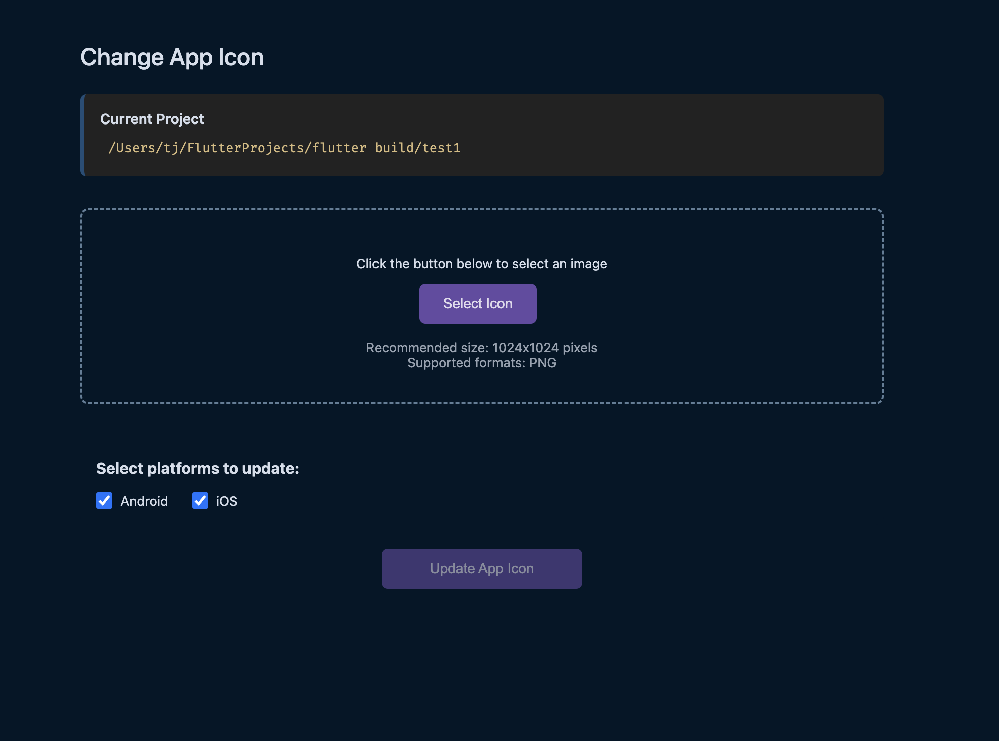

# Flutter Build

A Visual Studio Code extension that simplifies Flutter app configuration tasks. Easily rename your Flutter application and update app icons across both Android and iOS platforms with a user-friendly interface.

## Features

### 1. App Renaming
Quickly rename your Flutter application, including:
- App display name
- Package name/Bundle identifier
- Platform-specific configurations for Android and iOS
- Automatic updates across all necessary configuration files

### 2. App Icon Management
Update your app icons with ease:
- Single interface for both Android and iOS platforms
- Support for high-resolution PNG images
- Automatic icon resizing for all required dimensions
- Platform-specific icon generation

## Requirements
- Flutter SDK installed and configured
- A Flutter project with Android and/or iOS platforms

## Usage

1. Click on the Flutter Build icon in the Activity Bar (side bar)
2. Select or open your Flutter project
3. Choose an option from the context menu:
   - Rename App: Update your app's name and package identifier
   - Change App Icon: Update your app's icon for Android and iOS

### For Renaming App
1. Enter new app name
2. Enter new package name
3. Select target platforms (Android/iOS)
4. Click "Update Project"

### For Changing App Icon
1. Select your PNG icon file (recommended: 1024x1024)
2. Select target platforms (Android/iOS)
3. Click "Update App Icon"

## Release Notes

### 0.0.1
Initial release with core features:
- App renaming functionality
- App icon management
- Multi-platform support (Android & iOS)

## License

This extension is licensed under the MIT License.

---

**Enjoy building your Flutter apps! 🚀**
